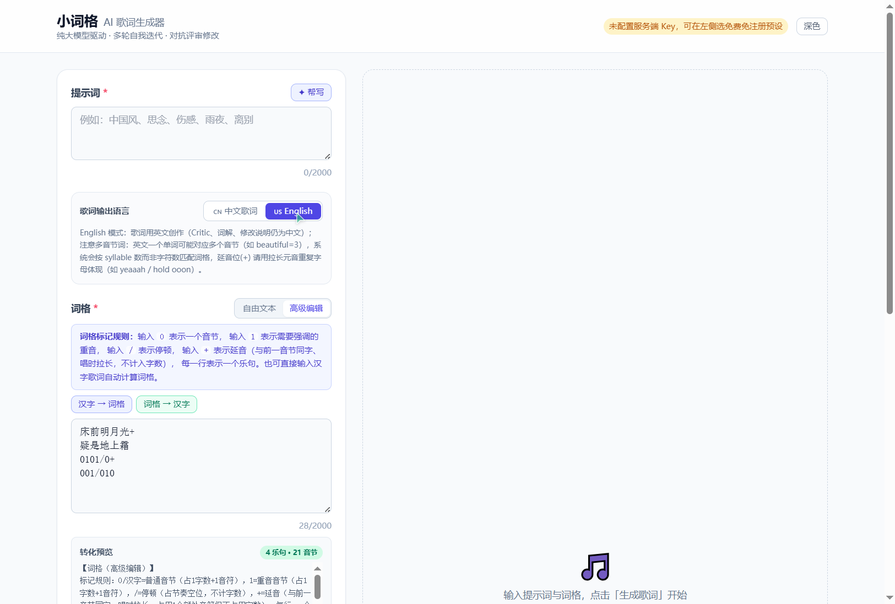
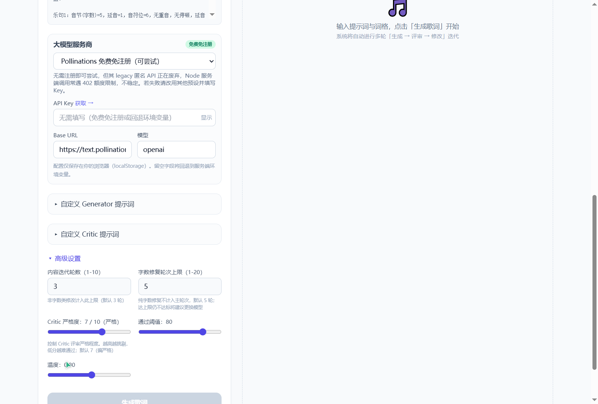
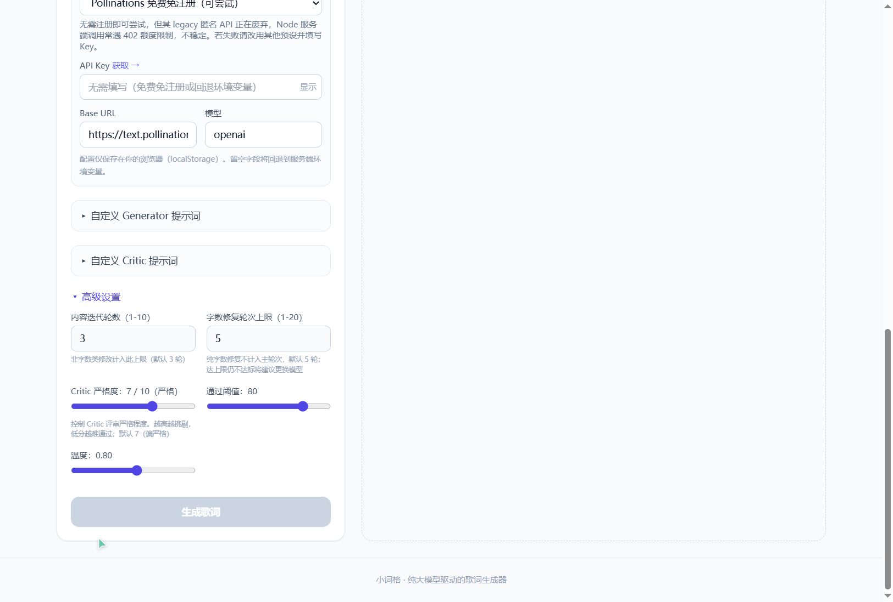

# 小词格 · AI 歌词生成器

> 纯大模型驱动 · 多轮自我迭代 · 对抗评审修改

小词格是一个基于多智能体协作的 AI 歌词生成工具。通过 Generator（生成）、Critic（评审）、Reviser（修改）、Interpreter（词解）四个智能体的多轮对抗式迭代，产出符合词格约束的高质量歌词。

## 实机演示

以下截图均为实际运行 `npm run dev` 后的浏览器实机抓取（localhost:3001）。

---

### 1. 主界面

应用启动后的主界面，包含提示词输入、词格输入、歌词语言切换、大模型服务商配置等区域。


**功能要点：**
- 提示词输入框支持 2000 字上限，内置「✦ 帮写」一键扩写功能
- 歌词输出语言切换：🇨🇳 中文歌词 / 🇺🇸 English
- 词格输入支持两种模式：自由文本 / 高级编辑
- 大模型服务商预置 10 家（含免费免注册选项）

---

### 2. 高级编辑模式

点击「高级编辑」切换到节奏标记输入模式，支持 `0`/`1`/`/`/`+` 四种标记符号。


**词格标记规则：**

| 标记 | 含义 | 是否计入字数 |
|------|------|:----------:|
| `0` 或汉字 | 普通音节 | ✅ |
| `1` | 重音音节（需强调） | ✅ |
| `/` | 停顿（气口/断句） | ❌ |
| `+` | 延音（拉长前一音节） | ❌ |

- 每一行 = 一个乐句
- 支持「汉字 → 词格」和「词格 → 汉字」一键互转
- 输入汉字歌词可自动计算词格音节数

---

### 3. 节奏标记实机输入

在高级编辑模式下输入含 `+` 延音标记的节奏词格，系统实时解析并显示音节数、延音位、音符位等信息。


**输入内容示例：**
```
床前明月光+
疑是地上霜
0101/0+
001/010
```

系统自动解析为标准化词格描述，包含：
- 每个乐句的音节数（字数）
- 延音位置（+ 标记，占用音符但不占字数）
- 重音位置（1 标记）
- 停顿位置（/ 标记）

**延音 `+` 在歌词中的体现：**
- 中文：拉长字尾或用「呀/哦/啊～」
- 英文：拉长前词末尾元音（如 `yeaaah` / `hold ooon`）
- **不得为延音新增单词或音节**

---

### 4. 英语歌词模式

切换到 🇺🇸 English 模式后，歌词用英文创作，评审/词解/修改说明仍为中文。



**英语模式核心规则：**
- 歌词正文输出地道英文，段落名用 `[Verse 1]` / `[Chorus]` / `[Bridge]` 等
- **按英语音节数（syllable）匹配词格**，非单词数、非字符数
- 多音节词按实际发音拆分计算：
  - `beautiful` = 3 音节（beau-ti-ful）
  - `lonely` = 2 音节（one-ly）
  - `love` = 1 音节
- 词格每句音节数 = 该句所有单词音节数之和，必须精确匹配
- 押韵在英文层面成立（元音相同才算押韵，如 `rain`/`pain` ✓）

---

### 5. 高级设置

展开「高级设置」面板，可调节评审严格度、迭代轮数、字数修复轮数等核心参数。



**可调参数：**

| 参数 | 范围 | 默认值 | 说明 |
|------|------|--------|------|
| 评审严格度 | 1-10 | 7 | 控制 Critic 评分松紧度 |
| 内容迭代轮数 | 1-10 | 3 | 生成→评审→修改主循环次数 |
| 字数修复轮数 | 1-20 | 5 | 纯字数问题独立修复上限（不计入主轮次） |
| 通过阈值 | 0-100 | 80 | Critic 总分达标线 |
| 温度 | 0-1.5 | 0.8 | LLM 创作温度 |

**评审严格度对 Critic 提示词的影响：**

严格度不再只是附加描述文字，而是**动态覆盖核心评分规则**：

| 严格度 | 模式 | 字数不符上限 | 平庸表达上限 | 套话上限 | passed 判定 |
|:------:|------|:----------:|:----------:|:------:|------------|
| 1-3 | 宽松 | 8 | 8 | 6 | 达标即可 |
| 4-6 | 标准 | 6 | 7 | 5 | 按阈值 |
| 7-8 | 严格 | 4 | 6 | 4 | 有 high issue 则不通过 |
| 9-10 | 极严 | 0 | 4 | 2 | structure_adherence=10 且无 high issue |

此外还支持自定义 Generator/Critic 的 system prompt（8000 字上限），可独立编辑并恢复默认。

---

### 6. 底部区域

页面底部展示操作提示与生成按钮。



点击「生成歌词」后，系统自动执行多轮「生成 → 评审 → 修改」迭代流程，通过 SSE 实时推送进度到前端。生成完成后可：
- 查看最终歌词与评审报告（含七维度雷达图）
- 查看迭代历史（每轮歌词与评分变化）
- 阅读词解与风格关键词
- 单句点击修改（保持原句字数/音节数不变）

---

## 技术架构

### 技术栈
- **框架**：Next.js 14 App Router + TypeScript
- **样式**：Tailwind CSS
- **LLM 调用**：OpenAI SDK（支持自定义 baseURL）
- **部署**：Vercel（maxDuration: 120s）

### 多智能体协作流程

```
用户输入（提示词 + 词格）
    │
    ▼
┌──────────┐     ┌──────────┐     ┌──────────┐
│ Generator │ ──▶ │  Critic  │ ──▶ │ Reviser  │
│  生成歌词  │     │ 评审打分  │     │ 按评审修改│
└──────────┘     └──────────┘     └──────────┘
                       │                  │
                       ▼                  │
                 达标？─────否────────────┘
                 │
                 │ 是
                 ▼
          ┌────────────┐
          │ Interpreter │
          │  词解+关键词 │
          └────────────┘
```

### 关键工程特性

- **词格字数最高优先**：所有 system prompt 将字数符合度列为第一标准
- **纯字数修复独立轮次**：纯字数问题最多修复 5 轮，不计入 3 轮主迭代
- **超时重试机制**：callLLM 内部 5 次重试 + 编排层 2 次基础设施重试
- **SSE 流式进度**：实时推送生成/评审/修改各阶段状态
- **中止按钮**：AbortController 控制，可随时停止生成
- **延音标记 `+`**：占用音符不占字数，中英文分别用长音体现
- **英语多音节适配**：按 syllable 而非字符数匹配词格
- **严格度动态覆盖**：Critic 评分阈值随严格度等级实时调整

### 支持的模型服务商

| 服务商 | 免费可用 | 说明 |
|--------|:--------:|------|
| Pollinations | ✅ | 免费免注册（不稳定） |
| OpenAI | ❌ | 需 API Key |
| DeepSeek | ❌ | 需 API Key |
| Moonshot (Kimi) | ❌ | 需 API Key |
| 通义千问 | ❌ | 需 API Key |
| 智谱 GLM | ❌ | 需 API Key |
| SiliconFlow | ❌ | 需 API Key |
| OpenRouter | ❌ | 需 API Key |
| 商汤日日新 | ✅ | 公测免费（1500次/5小时） |
| 自定义 | - | OpenAI 兼容协议 |

## 快速开始

```bash
# 安装依赖
npm install

# 启动开发服务器
npm run dev

# 构建
npm run build
```

打开 http://localhost:3000 即可使用。无需配置 API Key 即可尝试免费预设。

---

*本文档由 AI 自动生成，所有截图均为实机运行抓取。*
